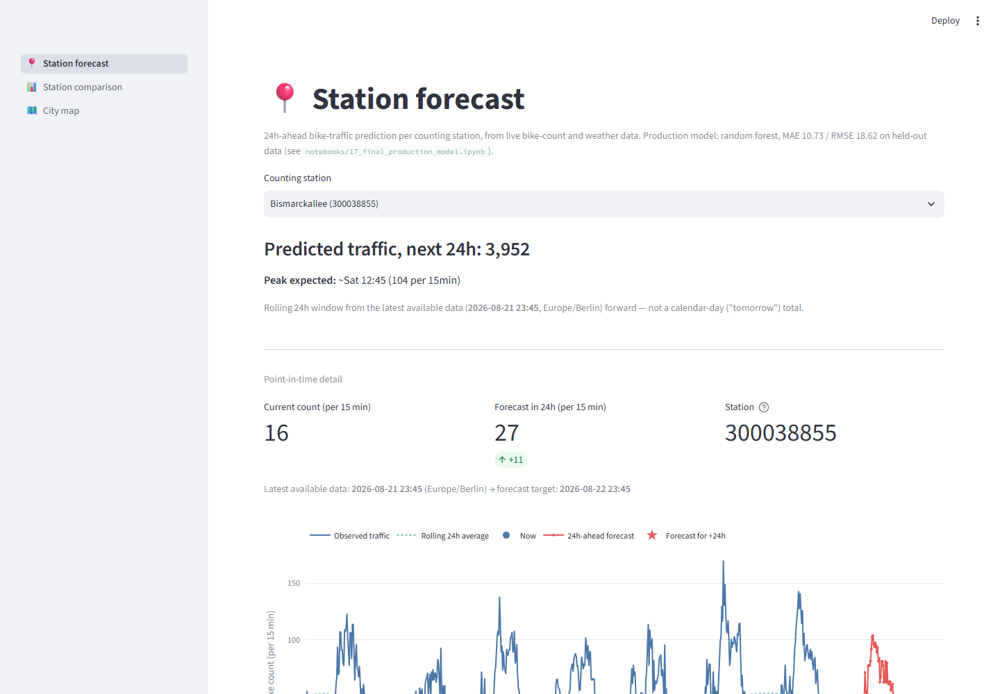
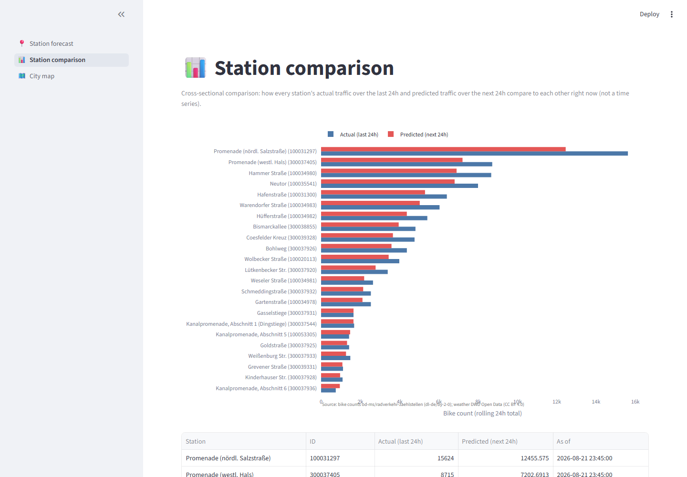
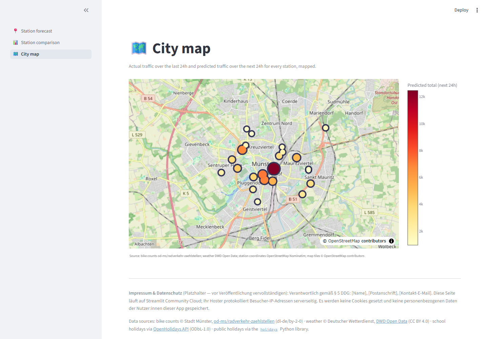

# Münster Bike Traffic Forecast

24-hour-ahead prediction of bike traffic volume per counting station in
Münster, combining historical 15-minute count data with weather data.

## Why

Münster already has good raw-data visualizations (Klimadashboard Münster,
Code-for-Münster's "traffic-dynamics"), but no active forecasting tool — the
only prior attempt is a set of frozen 2018 regression experiments. This
project aims to close that gap.

## Data sources & attribution

- **Bike counts**: [`od-ms/radverkehr-zaehlstellen`](https://github.com/od-ms/radverkehr-zaehlstellen)
  — 15-minute counts from 24 stations across the city, data since 2019/2023
  depending on station. Published by the City of Münster under
  [Datenlizenz Deutschland – Namensnennung 2.0](https://www.govdata.de/dl-de/by-2-0)
  (dl-de/by-2-0). *Attribution: Datenquelle Stadt Münster, dl-de/by-2-0.*
- **Weather data**: [DWD Open Data](https://opendata.dwd.de) (Deutscher
  Wetterdienst), hourly station observations. Licensed
  [CC BY 4.0](https://opendata.dwd.de/climate_environment/CDC/Nutzungsbedingungen_German.pdf).
  *Attribution: © Deutscher Wetterdienst (DWD).*
- **NRW school holidays**: fetched from the [OpenHolidays API](https://openholidaysapi.org/),
  licensed [ODbL 1.0](https://github.com/openpotato/openholidaysapi.data).
  *Attribution: contains data from OpenHolidays API, ODbL-1.0.* ODbL's
  share-alike clause applies to any *published derivative database*
  containing this data (not automatically to a dashboard's visual output,
  which ODbL treats separately as a "Produced Work") — revisit before
  publishing a raw combined dataset built on this data. See
  `src/muenster_bike_forecast/data/calendar.py`.
- **NRW university semester/lecture-period dates**: [NRW Ministry of
  Culture and Science (MKW)](https://www.mkw.nrw/service/vorlesungszeiten).
  Page content is under standard copyright; the specific lecture-period
  dates transcribed into this project are used as factual reference data.
  See `src/muenster_bike_forecast/data/semester_dates.py` for full
  provenance (which years are ministry-sourced vs. extrapolated).
- **Public holidays**: computed via the
  [`holidays`](https://pypi.org/project/holidays/) Python library
  ([MIT](https://github.com/vacanza/holidays/blob/dev/LICENSE)), no
  external fetch.

Bike-count and weather data require attribution but are otherwise freely
reusable, including commercially. School-holiday data carries additional
share-alike obligations for published derivatives — see the note above.
All other dependencies (pandas, requests, scikit-learn, matplotlib,
jupyter, pytest, black) use standard permissive OSS licenses (BSD/MIT/
Apache-family).

## Setup

```bash
python -m venv .venv
.venv\Scripts\activate
pip install -r requirements.txt
```

## Running the dashboard

```bash
streamlit run app.py
```

Fetches live bike-count (od-ms/radverkehr-zaehlstellen) and weather (DWD
Open Data) data at request time and runs the committed production model
(`models/production_random_forest.joblib`) to forecast traffic 24h ahead
for the selected station. No API keys or credentials needed. Deployed on
[Streamlit Community Cloud](https://streamlit.io/cloud) from this public
repo.

### Screenshots

**Station forecast** — live 24h-ahead forecast for one station, with the
observed history and forecast curve:



**Station comparison** — actual (last 24h) vs. predicted (next 24h)
traffic across all stations:



**City map** — the same comparison, plotted geographically:



## Daily forecast-accuracy email

A scheduled GitHub Actions workflow (`.github/workflows/daily_forecast_email.yml`,
~09:00 Münster local time) runs `scripts/send_daily_email.py`, which:

- Checks every station's predicted traffic *total* over the last 24h
  against the actual total over that same window (recomputed from the
  same live data the dashboard uses — no forecast history is stored
  anywhere) and shows today's fresh rolling-next-24h total forecast too.
- Asks Claude for a short, grounded explanation of the biggest deviations
  (default: top 3 by absolute error).
- Emails the result via Gmail, as an HTML report with a plain-text fallback.

Unlike the dashboard, this **does** need credentials — set these as
[GitHub Actions secrets](https://docs.github.com/en/actions/security-guides/encrypted-secrets)
(repo Settings → Secrets and variables → Actions), never committed:

- `GMAIL_ADDRESS` / `GMAIL_APP_PASSWORD` — sender, via a
  [Gmail app password](https://support.google.com/accounts/answer/185833).
- `RECIPIENT_EMAIL` — where the report is sent.
- `ANTHROPIC_API_KEY` — from [console.anthropic.com](https://console.anthropic.com/).
  **A Claude Pro/Max subscription does not cover this** — API usage is
  billed separately from a Console account.

See `.env.example` for local dry runs (`python scripts/send_daily_email.py`
with these four variables exported).

## Layout

- `notebooks/` — numbered analysis/modeling notebooks
- `src/muenster_bike_forecast/` — reusable data loading, feature engineering,
  modeling, and live-inference code
- `app.py` — Streamlit dashboard entry point
- `scripts/` — one-shot orchestration entry points (currently just the
  daily forecast-accuracy email)
- `.github/workflows/` — scheduled CI (the daily email)
- `models/` — mostly gitignored (regenerate from notebooks), except
  `production_random_forest.joblib` and `weekend_weekday_ratio.csv`, which
  are committed since the deployed dashboard needs them directly
- `data/raw/` — raw downloaded data (gitignored, regenerate from notebooks)
- `tests/` — unit tests
