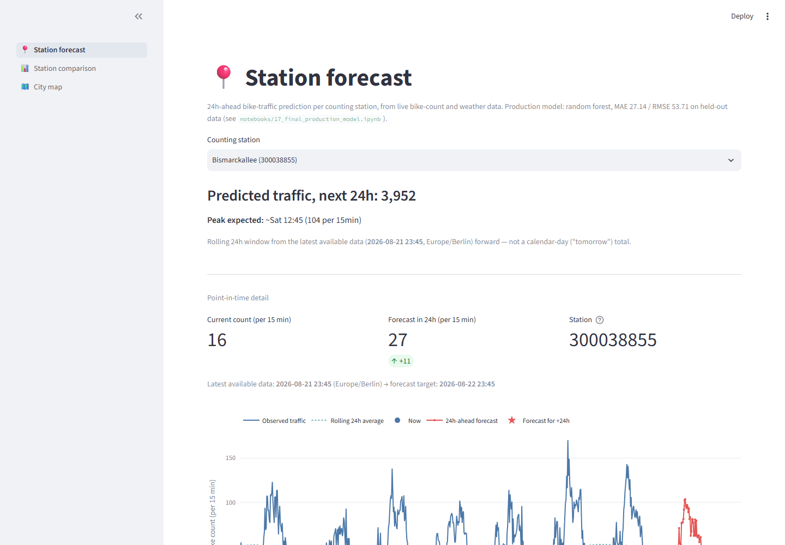
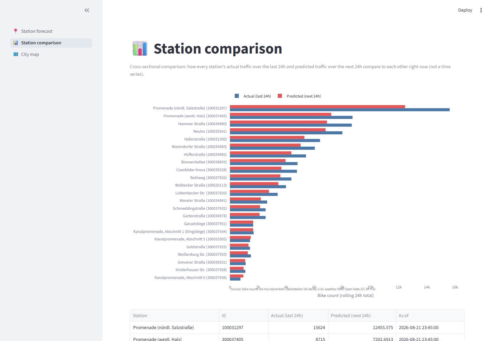
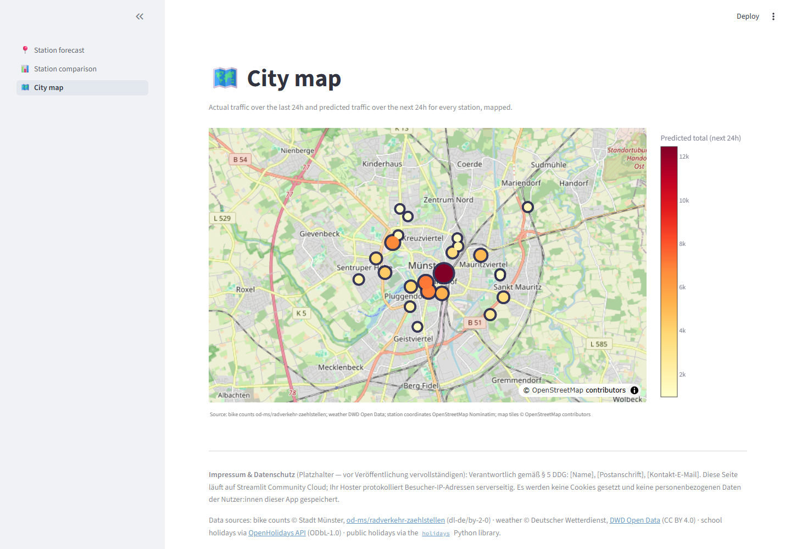

# Münster Bike Traffic Forecast

24-hour-ahead prediction of bike traffic volume per counting station in
Münster, combining historical 15-minute count data with weather data.

## Why

Münster already has good raw-data visualizations (Klimadashboard Münster,
Code-for-Münster's "traffic-dynamics"), but no active forecasting tool — the
only prior attempt is a set of frozen 2018 regression experiments. This
project aims to close that gap.

## Data sources & attribution

- **Bike counts**: [`od-ms/radverkehr-zaehlstellen`](https://github.com/od-ms/radverkehr-zaehlstellen)
  — 15-minute counts from 24 stations across the city, data since 2019/2023
  depending on station. Published by the City of Münster under
  [Datenlizenz Deutschland – Namensnennung 2.0](https://www.govdata.de/dl-de/by-2-0)
  (dl-de/by-2-0). *Attribution: Datenquelle Stadt Münster, dl-de/by-2-0.*
- **Weather data**: [DWD Open Data](https://opendata.dwd.de) (Deutscher
  Wetterdienst), hourly station observations. Licensed
  [CC BY 4.0](https://opendata.dwd.de/climate_environment/CDC/Nutzungsbedingungen_German.pdf).
  *Attribution: © Deutscher Wetterdienst (DWD).*
- **NRW school holidays**: fetched from the [OpenHolidays API](https://openholidaysapi.org/),
  licensed [ODbL 1.0](https://github.com/openpotato/openholidaysapi.data).
  *Attribution: contains data from OpenHolidays API, ODbL-1.0.* ODbL's
  share-alike clause applies to any *published derivative database*
  containing this data (not automatically to a dashboard's visual output,
  which ODbL treats separately as a "Produced Work") — revisit before
  publishing a raw combined dataset built on this data. See
  `src/muenster_bike_forecast/data/calendar.py`.
- **NRW university semester/lecture-period dates**: [NRW Ministry of
  Culture and Science (MKW)](https://www.mkw.nrw/service/vorlesungszeiten).
  Page content is under standard copyright; the specific lecture-period
  dates transcribed into this project are used as factual reference data.
  See `src/muenster_bike_forecast/data/semester_dates.py` for full
  provenance (which years are ministry-sourced vs. extrapolated).
- **Public holidays**: computed via the
  [`holidays`](https://pypi.org/project/holidays/) Python library
  ([MIT](https://github.com/vacanza/holidays/blob/dev/LICENSE)), no
  external fetch.

Bike-count and weather data require attribution but are otherwise freely
reusable, including commercially. School-holiday data carries additional
share-alike obligations for published derivatives — see the note above.
All other dependencies (pandas, requests, scikit-learn, matplotlib,
jupyter, pytest, black) use standard permissive OSS licenses (BSD/MIT/
Apache-family).

## Setup

```bash
python -m venv .venv
.venv\Scripts\activate
pip install -r requirements.txt
```

For local dev tooling not needed by the deployed app (currently just
Playwright, for dashboard screenshots/visual verification):

```bash
pip install -r requirements-dev.txt
playwright install chromium
```

## Running the dashboard

```bash
streamlit run app.py
```

Fetches live bike-count (od-ms/radverkehr-zaehlstellen) and weather (DWD
Open Data) data at request time and runs the committed production model
(`models/production_lightgbm.joblib`) to forecast traffic 24h ahead
for the selected station. No API keys or credentials needed. Deployed on
[Streamlit Community Cloud](https://streamlit.io/cloud) from this public
repo.

### Screenshots

**Station forecast** — live 24h-ahead forecast for one station, with the
observed history and forecast curve:



**Station comparison** — actual (last 24h) vs. predicted (next 24h)
traffic across all stations:



**City map** — the same comparison, plotted geographically:



## Daily forecast-accuracy email

A scheduled GitHub Actions workflow (`.github/workflows/daily_forecast_email.yml`,
~09:00 Münster local time) runs `scripts/send_daily_email.py`, which:

- Checks every station's predicted traffic *total* over the last 24h
  against the actual total over that same window (recomputed from the
  same live data the dashboard uses — no forecast history is stored
  anywhere) and shows today's fresh rolling-next-24h total forecast too.
- Asks Claude for a short, grounded explanation of the biggest deviations
  (default: top 3 by absolute error).
- Emails the result via Gmail, as an HTML report with a plain-text fallback.

Unlike the dashboard, this **does** need credentials — set these as
[GitHub Actions secrets](https://docs.github.com/en/actions/security-guides/encrypted-secrets)
(repo Settings → Secrets and variables → Actions), never committed:

- `GMAIL_ADDRESS` / `GMAIL_APP_PASSWORD` — sender, via a
  [Gmail app password](https://support.google.com/accounts/answer/185833).
- `RECIPIENT_EMAIL` — where the report is sent.
- `ANTHROPIC_API_KEY` — from [console.anthropic.com](https://console.anthropic.com/).
  **A Claude Pro/Max subscription does not cover this** — API usage is
  billed separately from a Console account.

See `.env.example` for local dry runs (`python scripts/send_daily_email.py`
with these four variables exported).

## Local MCP forecast-query server

`scripts/mcp_forecast_server.py` is a local-only (stdio transport) [MCP](https://modelcontextprotocol.io)
server exposing three tools for ad hoc forecast queries from a chat
session, wrapping the same live-inference/accuracy-check logic the
dashboard and daily email already use — no separate model, no separate
fetch path:

- `list_stations` — every counting station with live data available.
- `get_forecast(station_id, as_of=None)` — a live 24h-ahead forecast for
  one station (predicted next-24h total, peak time/value, actual last-24h
  total for context).
- `get_actual_vs_predicted(station_id, as_of=None)` — how the model's
  most recent prediction compares to what actually happened. This
  project keeps no forecast-history storage, so it always compares the
  latest resolvable ~24h window, not an arbitrary past date.

**Local/stdio only, deliberately** — reachable only from sessions on this
machine, no hosting cost, no auth needed. A remote/HTTP-reachable version
(e.g. for the Claude mobile app) is a separate, larger piece of work, not
built here.

Setup:

```bash
pip install -r requirements-dev.txt
```

Register it with Claude Code (verified against the current `claude mcp add`
CLI as of this session):

```bash
claude mcp add muenster-bike-forecast -- /path/to/.venv/Scripts/python.exe scripts/mcp_forecast_server.py
```

(Use the venv's actual `python`/`python.exe` path so the server sees the
project's installed dependencies — a bare `python` may resolve to a
different interpreter.) Or run it directly for local testing without
registering: `python scripts/mcp_forecast_server.py`.

## Layout

- `notebooks/` — numbered analysis/modeling notebooks
- `src/muenster_bike_forecast/` — reusable data loading, feature engineering,
  modeling, and live-inference code
- `app.py` — Streamlit dashboard entry point
- `scripts/` — one-shot orchestration entry points (the daily
  forecast-accuracy email, the local MCP forecast-query server)
- `.github/workflows/` — CI (`ci.yml`: black + pytest on push/PR) and the
  scheduled daily email (`daily_forecast_email.yml`)
- `models/` — mostly gitignored (regenerate from notebooks), except
  `production_lightgbm.joblib`, which is committed since the deployed
  dashboard needs it directly
- `data/raw/` — raw downloaded data (gitignored, regenerate from notebooks)
- `data/processed/` — small derived/cached tables committed to the repo
  (currently `station_locations.csv`, geocoded once and reused rather than
  re-fetched)
- `data/model_metrics/` — the shared cross-notebook metrics registry
  (`registry.csv`, committed) that notebooks 08-18 write to and read from,
  so every notebook's displayed metrics come from one live source instead
  of hardcoded copies
- `tests/` — unit tests

## A note on this project, written August 2026

My primary goal with this project was to get to know agentic development,
and Claude Code specifically.

The way I worked with Claude: small steps with checkpoints, decisions
written down as we went, structured review and audit steps built into the
process. But I should be honest about what that review actually was — I
didn't do a concrete code review myself, and I don't have a deep
understanding of the code. Claude wrote it. The review that happened was
procedural — checklists, audit passes — not me personally reading and
verifying the logic.

That points to something bigger: the role of the technical implementer
seems to be shifting. Working this way, you end up acting more like a
feature or product manager than a technical implementer — because agentic
AI can do that part itself.

Working with generative AI in an agentic system like this showed me
something concrete about where things stand right now. There's a real set
of things I couldn't have built on my own. And a bigger set of things I
could have done myself, just a lot slower. Both are genuine wins.

What it hasn't solved yet is the last bit of polish. At one point a bug
quietly double-counted every bike in the target variable, and it got past
the review process — neither Claude nor I caught it at the time. Given
that I wasn't reviewing the code myself, that's maybe not surprising in
hindsight.

Which is probably the real lesson: good tests matter. Both in the code
itself, and in the review processes the tooling brings along — hooks,
subagents, skills. And on top of that, human review, especially at the
critical points, because the tooling alone didn't catch everything here.

Context is key, too. The real challenge is weaving agentic systems into
the development process safely and cleanly. Without that context, though,
working with agents stays a patchwork — isolated pieces that never quite
add up.

For a normal business setting, the right approach is probably a middle
ground: not full autonomy with no code review, but also not a return to
working without AI. Agentic AI is a real productivity gain, but not one
to run unsupervised yet — someone needs to actually understand and check
the code it writes, which wasn't fully the case here.

One more thing, and this one's just my opinion: I think AI devalues
software as a product. Not the quality — the code here works. But when a
model, a dashboard, a daily report and an MCP server come out of
describing what I wanted, it starts to feel like anyone could write this.
And what feels like anyone could write it is hard to sell.

Most of this project's Claude Code sessions were done with **Sonnet 5**, not Opus. A stronger model like Opus or Fable might have caught more, and some conclusions above could look different with one of those instead.
